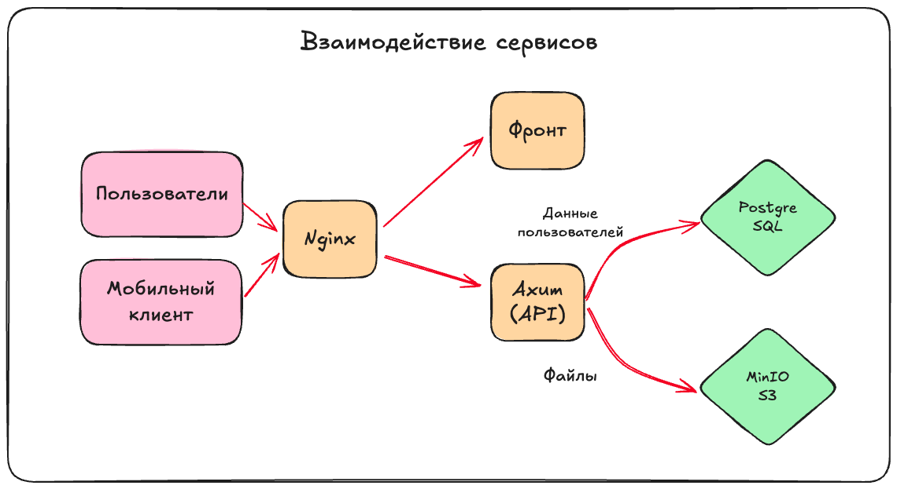

 

  

  <h1 align="center">BooQ</h1>

booq - продукт, предоставляющий Coworking as a Service (CaaS).

\[TODO\] три экрана приложения на красивом сером фоне;

BooQ - B2B продукт. Он ориентирован на владельцев и пользователей
коворкингов, компьютерных клубов, и других мест, в которых можно бронировать места.

BooQ предоставляет удобный конструктор пространств, гибкую систему ролей пользователей,
а также удобное управление пространствами и бронированиями в них.

Фронтенд доступен по
ссылке: [prod-team-13-cltnksuj.final.prodcontest.ru](https://prod-team-13-cltnksuj.final.prodcontest.ru).

Swagger UI с описанием конечных точек проекта доступен по
ссылке: [prod-team-13-cltnksuj.final.prodcontest.ru/api/swagger-ui](https://prod-team-13-cltnksuj.final.prodcontest.ru/api/swagger-ui).

Apk-файл мобильного приложения для Android можно скачать по ссылке: (TODO ссылка)

## Структура проекта

Проект разрабатывается в монорепозитории.

Бэкенд проекта находится в папке [`./backend`](./backend),
фронтенд - в папке [`./frontend`](./frontend),
мобильное приложение - в папке [`./mobile`](./mobile).

Трафиком управляет nginx, его конфиг лежит в [`./nginx`](./nginx).

Для хранения файлов используется MinIO S3, а для хранения других данных - PostgreSQL.
Они запускаются через docker-compose.yml, вместе с остальными сервисами.
Конфигурация контейнеров, в которых запускается проект, доступна в файле [`compose.yml`](./compose.yml).

Сервисы взаимодействуют между собой так:

## Запуск проекта

Зависимости:

- Docker
- Docker Compose

Чтобы запустить проект, необходимо использовать команду `docker compose up --build -d` в корневой директории проекта.

## Фичи проекта

- Владельцы коворкингов могут создавать места для коворкингов (здания), а также сами коворкинги (этажи в зданиях)
- Владельцы коворкингов могут гибко настраивать коворкинги, изменять их размер, изменять объекты в коворкингах и их
  свойства
- Для изменения пространств на фронтенде доступен удобный конструктор
- В коворкингах имеется гибкая система ролей:
-
    - Гость
-
    - Подтверждённый гость
-
    - Пользователь
-
    - Администратор
- Гость может подтвердить свой профиль онлайн, загрузив документ, подтверждающий его личность в систему и получив
  одобрение администратора коворкинга
- Клиенты могут бронировать места в коворкингах
- В зависимости от своей роли, клиент получает право бронировать различные места

## Данные для доступа

Для тестирования системы членами жюри были созданы тестовые аккаунты.
Данные от них находятся в файле [credentials.md](./credentials.md)
