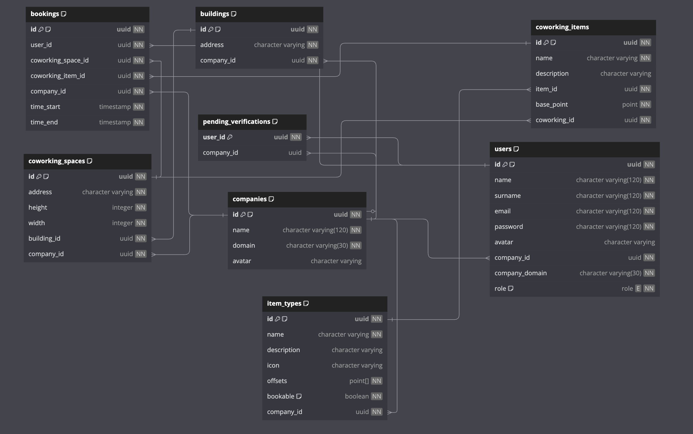
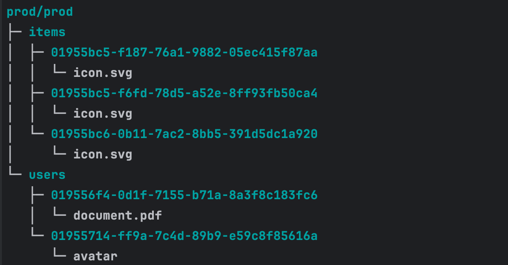

# Бэкенд проекта

Ссылка на Swagger UI: [**клик**](https://prod-team-13-cltnksuj.final.prodcontest.ru/api/swagger-ui/).

Описание взаимодействия сервисов между собой, а также описание структуры сервисов проекта
находится в [основном README.md](../README.md).

## Стек технологий

Бэкенд написан на Rust, с использованием фреймворков:

- axum для создания API
- sqlx для работы с БД и валидации запросов во время компиляции решения
- utoipa для генерации документации к эндпоинтам в формате OpenAPI
- других, включая serde и validator

## База Данных

Мы храним данные пользователей в PostgreSQL.

В рамках БД мы развернули таблицы которые связаны между собой Foreign Key.
Для ускорения работы запросов на некоторые поля в таблицы добавлены индексы,
а для предотвращения наслоений бронирований друг на друга используются CHECK в таблице bookings.

Схема БД представлена на рисунке:

## Объектное хранилище

Мы используем self-hosted MinIO S3 для хранения документов, которые загрузили пользователи, их аватарок, а также иконок
предметов в коворкинге.

Файловая структура в S3 выглядит следующим образом:

## CI/CD

Бэкенд автоматически собирается и деплоится на удалённый сервер, используя GitLab CI.

Файл конфигурации CI можно посмотреть в файле [`.gitlab-ci.yml`](../.gitlab-ci.yml).

## Тестирование

Код покрыт интеграционными и юнит-тестами.
Они написаны на PyTest и находятся в папке [`python-client/tests`](./python-client/tests).

Для запуска тестов перейдите в папку [`python-client`](./python-client), установите зависимости из `requirements.txt`
и запустите тесты через команду `pytest`.

Тесты проверяют работоспособность функциональности приложения,
включая регистрацию новых пользователей и компаний, а также
