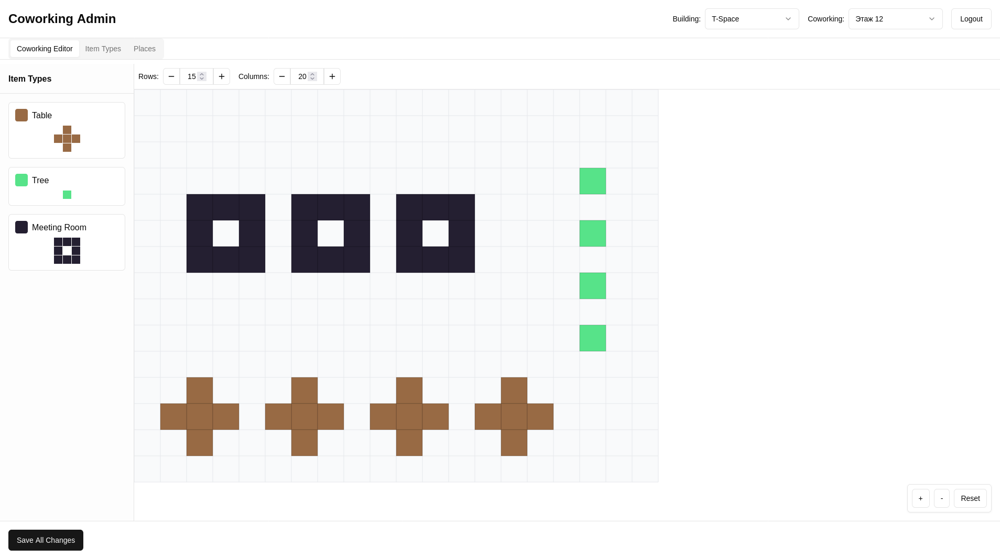
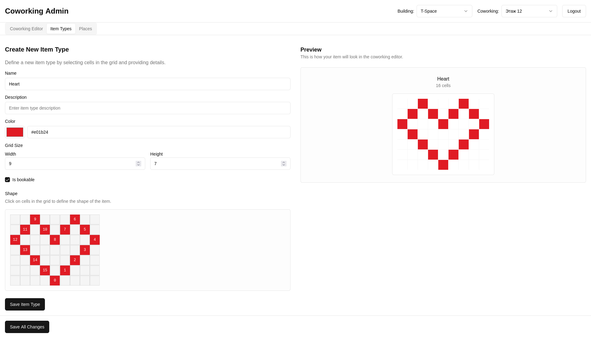

# Фронтенд проекта

Фронтенд доступен по ссылке: [**клик**](https://prod-team-13-cltnksuj.final.prodcontest.ru/).

На фронтенде размещён конструктор пространств, через который можно управлять зданиями и коворкингами в них, а также
управлять размещением предметов в коворкингах.

Для добавления предмета в коворкинг нужно создать тип предмета с его формой, цветом, названием,
а также указанием того, можно ли забронировать этот тип предметов.

Для удаления созданного элемента нужно нажать по нему правой кнопкой мыши, а затем нажать Delete/Backspace.

Примеры экранов фронтенда:

